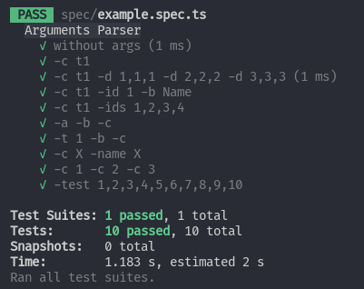

# Homework1 作業說明

你的目標是撰寫一個終端機的指令界面，用以操作簡易的圖書管理工具

因應本課程的目標是網頁遊戲引擎原理與實作，首次的作業會專注在 JavaScript Core 的核心練習上

- String operate
- Array operate
- Object operate
- Interface & Class
- Async/Await & Promise
- 文件閱讀

等主要概念，會是前幾次課程的主要練習目標

- [Homework1 作業說明](#homework1-作業說明)
  - [npm script](#npm-script)
    - [系統關聯圖](#系統關聯圖)
  - [文件需求](#文件需求)
    - [Command Defined](#command-defined)
  - [Collect 指令一覽](#collect-指令一覽)
    - [`lb drop collect`](#lb-drop-collect)
    - [`lb drop collect -c [collect]`](#lb-drop-collect--c-collect)
    - [`lb make collect -c [collect]`](#lb-make-collect--c-collect)
    - [`lb insert -c [collect] -d <...books>`](#lb-insert--c-collect--d-books)
    - [`lb update -c [collect] -id [bookId] -name [bookName]`](#lb-update--c-collect--id-bookid--name-bookname)
    - [`lb delete -c [collect] <filter>`](#lb-delete--c-collect-filter)
    - [`lb import -f [filename]`](#lb-import--f-filename)
  - [輸入範例與提示](#輸入範例與提示)
    - [Drop Collect](#drop-collect)
    - [Make Collect](#make-collect)
    - [Insert Collect](#insert-collect)
    - [Update Collect](#update-collect)
    - [Delete Collect](#delete-collect)
    - [Import Collect](#import-collect)
  - [實作需求](#實作需求)
  - [分數](#分數)

## npm script

- 請在專案根目錄執行套件管理器 (預設為 `npm`，若你使用的是 `pnpm`, `yarn` 也可以)
- npm script
  - `npm run dev` 進入開發模式，這會監測 `src` 底下的程式碼更動，並即時進行編譯
  - `npm run start` 會執行 `bin/cli`，這也是作業進入點
  - `npm run test` 會掃描 `spec/*.spec.ts` 的單元測試檔案並進行測試

### 系統關聯圖



在 `src/types` 中，已經預先定義好以下幾個 Interface(上圖的紅色矩形)

- ICommander
- IResourceOperator
- IStorage

你應該實現以下的類別：

- Commander
- CollectOperator
- JSONStorage

## 文件需求

以下區塊說明輸入指令的相關需求

### Command Defined

一個命令的呼叫方式如下：

```sh
lb <command> <component> [argument]
```

`<commmand>` 支援以下的數值

- `drop`
- `make`
- `insert`
- `delete`
- `update`
- `import`

`<component>` 支援以下的數值

- `collect`

`[argument]`

統一以 `-<arg> <value>` 的方式定義，且 Value 必定為 `string` type

- `-n 100 -k 10 -j test`
  - `n` 為 '100'
  - `k` 為 '10'
  - `j` 為 'test'

並且輸入順序不影響解析，且空格數量也不影響解析：

- `-n 100 -k 10 -j test`
- `-n 100 -j test -k 10`
- `-k 10 -n 100 -j test`
- `-k 10 -j test -n 100`
- `-j test -k 10 -n 100`
- `-j test -n 100 -k 10`

以上 6 個輸入的解析結果要完全相同

若一個參數有說明可以通過 `-<arg> <val1>,<val2>,<val3>...` 的方式輸入，代表該輸入是個陣列

- 輸入 `-n 1`
  - 解析為 `{ n: '1' }`
- 輸入 `-n 1,2,3,4,5,6` (假設有說明可以連續輸入)
  - 解析為 `{ n: ['1', '2', '3', '4', '5', '6'] }`
- 輸入 `-n 1,2,3,4,5,6` (假設沒有說明可以連續輸入)
  - 解析為 `{ n: '1,2,3,4,5,6' }`

部份題目會說明，可以連續使用同樣的參數來定義陣列

- 輸入 `-n 1 -n 2 -n 3` (假設有說明可以連續定義參數)
  - 解析為 `{ n: '1,2,3,4,5,6' }`
- 輸入 `-n 1 -n 2 -n 3` (假設沒有說明可以連續定義參數)
  - 解析為 `{ n: '3' }` ，根據輸入順序，只會解讀成 n = 3
請注意，一個 `value` 絕對不會以 `-`開頭，舉例來說：

- `-a 1 -b 2 -c 3`
  - 解析為 `{ a: '1', b: '2', c: '3' }`

- `-a -b`
  - 應該解析為 `{ a: undefined, b: undefined' }`
  - 不是解析為 `{ a: '-b' }`

## Collect 指令一覽

---

### `lb drop collect`

清除所有的書籍資訊

Output:

- 完成後
  - 若刪除資料，輸出 `N DELETED`, N 為刪除的數量
  - 無刪除資料，輸出 `0 DELETED`

---

### `lb drop collect -c [collect]`

清除所有 `[collect]` 底下的書籍資訊

```shell
lb drop collect -c default # 清除所有 `default` 名稱空間底下的書籍資訊
lb drop collect -c TEST    # 清除所有 `TEST` 名稱空間底下的書籍資訊
```

Define:

- `-c [collect]` 定義一個 Collect Name，測資不會包含**中文與空白**

Output:

- 缺少`[collect]`參數，輸出錯誤訊息 `ERR_ARGS_COLLE`
- `[collect]` 不存在則輸出錯誤訊息 `ERR_COLLE`
- 完成後
  - 若刪除資料，輸出 `1 DELETED`
  - 無刪除資料，輸出 `0 DELETED`

---

### `lb make collect -c [collect]`

建立一個新的 `[collect]`

```shell
lb make collect -c default # 建立 `default` 名稱空間
lb make collect -c TEST    # 建立 `TEST` 名稱空間
```

Define:

- `-c [collect]` 定義一個 Collect Name，測資不會包含**中文與空白**

Output:

- 缺少`[collect]`參數，輸出錯誤訊息 `ERR_ARGS_COLLE`
- 若 `[collect]` 重複，輸出錯誤訊息 `ERR_COLLE_DUPL`
- 完成後
  - 輸出 `SUCCESS`

---

### `lb insert -c [collect] -d <...books>`

在 `[collect]` 底下建立 `[book-data]` 的資訊

```shell
lb insert collect -c en -d 01,effective-c,9787115612953 # 在 `en` 底下建立 effective-c 這本書
lb insert collect -d 01,effective-c,9787115612953 -c en # 效果同上
lb insert collect -d 01,effective-c,9787115612953 -c NotExistCollect # 失敗
lb insert collect -d 01,effective-c,9787115612953 -c NotExistCollect # 失敗
lb insert collect -d 01,effective-c,9787115612953 -d 02,cpp-reference,0275967819 -c tw # 失敗
lb insert collect -d -c tw # 失敗
```

Define:

- `-c [collect]` 定義一個 Collect Name，測資不會包含**中文與空白**
- `-d <...books>`
  - `<books>` 由 `<bookId>,<bookName>,<isbn>` 的形式組成
  - *可以通過多個 -d 連續定義*
  - bookId, bookName, isbn 測資**僅包含英數字**
- 多個 `-d` 的多筆輸入
  - 只有有任何一個 `id`, `isbn` 錯誤，整批資料建立失敗，並輸出錯誤訊息
  - 不必考慮多筆輸入的 `id`, `isbn` 重複
    - 不會有 `-d 1,name1,9787115612953 -d 1,name1,9787115612953` 之類的測資

Output:

- 根據缺少的參數
  - 缺少 `[collect]`，輸出錯誤訊息 `ERR_ARGS_COLLE`
  - 缺少 `<books>`( `-d` 後沒有任何輸入)，輸出錯誤訊息 `ERR_ARGS_BOOK`
- `[collect]` 須存在，不存在則輸出錯誤訊息 `ERR_COLLE`
- `<books>`
  - *可以通過多個 `-d` 連續定義書籍*
  - `bookId`
    - `id` 已經存在，輸出錯誤訊息 `ERR_ID_DUPL`
    - `id` 必須為 `0-9` 組成的任意字串，不符合則輸出 `ERR_ID`
  - `isbn`
    - `isbn` 已經存在，輸出錯誤訊息 `ERR_ISBN_DUPL`
    - `isbn` 不符合格式，輸出錯誤訊息 `ERR_ISBN`
- 完成後
  - 輸出 `N INSERTD` ，其中 N 為建立的書籍數量

---

### `lb update -c [collect] -id [bookId] -name [bookName]`

在 `[collect]` 底下更新一本書籍的資訊

```shell
lb update collect -c en -id 1 -name Name
```

Define:

- `-c [collect]` 定義一個 Collect Name，測資不會包含**中文與空白**
- `-id [bookId]` - 輸入一本書籍的 `id`
- `-name [bookName]` - 打算更新的書名，**測資僅包含英數字**

Output:

- 根據缺少的參數
  - 缺少 `[collect]`，輸出錯誤訊息 `ERR_ARGS_COLLE`
  - 缺少 `[bookId]`，輸出錯誤訊息 `ERR_ARGS_ID`
  - 缺少 `[bookName]`，輸出錯誤訊息 `ERR_ARGS_BOOK`
- `[collect]` 須存在，不存在則輸出錯誤訊息 `ERR_COLLE`
- `[bookId]` 須存在，不存在則輸出錯誤訊息 `ERR_ID`
- 完成後
  - 輸出 `SUCCESS`

---

### `lb delete -c [collect] <filter>`

刪除 在 `[collect]` 底下符合 filter 的書籍資訊


```shell
# 刪除 en 底下 id 為 1 2 3 4 的書籍
lb delete -c en -ids 1,2,3,4

# 刪除 en 底下 id 為 1 2 的書籍 或是 name 為 book book 的書籍
lb delete -c zh -ids 1,2 -names book1,book
```

Define:

- filter
  - `-ids [id1,id2,id3 ...]` - 刪除所有符合 id 的書籍資訊
  - `-names [name1, name2, name3...]` - 刪除所有符合 name 的書籍資訊
  - Filter 可以只定義 `-ids` 或是只定義 `-names`，也可以同時定義兩個
    - 測資**必定包含 Filter**，可以不用考慮沒有 Filter 的情況
    - `-ids` 和 `-names` 的解析結果為陣列

Output:

- 根據缺少的參數
  - 缺少 `[collect]`，輸出錯誤訊息 `ERR_ARGS_COLLE`
  - 本題輸入測資一定包含 `<filter>`，可以不用考慮
- `[collect]` 須存在，不存在則輸出錯誤訊息 `ERR_COLLE`
- 完成後
  - 輸出 `N DELETED` ，其中 N 為刪除的書籍數量
  - 若沒有匹配到任何書本，輸出 `0 DELETED`

---

### `lb import -f [filename]`

匯入一個檔案，結構如下：

```json
{
  "[collectionName]": [
    {
      bookId: "book-id",
      bookName: "book-name",
      isbn: "book-isbn"
    }
    /* More Book... */
  ],
  /* More Collection */
}
```

Define:

- `[collectionName]` 是 JSON 的 Key，代表的是 collection 的名稱
- `[collectionName]` 的 Value 是若干個 Book 的資訊
  - 結構為 `Array<{bookId, bookName, isbn}>`

Output:

- 缺少 `[filename]`，輸出錯誤訊息 `ERR_ARGS_FNAME`
- 若 `[filename]` 已存在，輸出錯誤訊息 `ERR_FNAME`
- 解析順序：
  - 首先判斷 Collection 是否重複 - `ERR_COL_DUPL`
  - 其次判斷 `ERR_ID_DUPL`
  - 最後判斷 `ERR_ISBN`
  - 出現任何錯誤，整批資料都不匯入
- 完成後
  - 輸出 `SUCCESS`

## 輸入範例與提示

| Command  | Output   | State  | Scenario     |
| -------- | -------- | ------ | ------------ |
| 預期輸入 | 預期輸出 | 狀態碼 | 建立時的情境 |

另外，非常重要的提示：

若一個指令的說明為： `lb make user -u [username] -p [password] -a [algo]`

由左到右，就是參數的重要度 (username > password > algo)
然後在規則上，有無輸入參數 > 參數是否存在 > 參數是否符合規則

1. 題目的參數都是 require, 沒有 optional 的，先判斷參數有沒有輸入
2. 參數 collect / username / bookId / isbn 需要檢查是否重複被建立
3. 檢查參數是否符合規則
4. 只需要輸出優先度最高的錯誤即可

Example `lb make user -u usr` 違反了以下錯誤：

1. 沒有 username
2. 沒有 password
3. 沒有 algo
4. username 不符合長度限制 [4, 8]

只需要輸出 `ERR_ARGS_UNAME` 即可

Example `lb make user -u user -p 123 -algo md6` 違反了以下錯誤：

1. 假設 username 重複
2. password 不符合長度限制 [4, 8]
3. algo 不符合規則

只需要輸出 `ERR_UNAME_DUPL` 即可

若 1. username 沒有重複

只需要輸出 `ERR_PASSWD` 即可


### Drop Collect

| Command               | Output         | State          | Scenario           |
| --------------------- | -------------- | -------------- | ------------------ |
| lb drop collect       | 5 DELETED      | SUCCESS        | 存在5個 Collect    |
| lb drop collect       | 0 DELETED      | SUCCESS        | 不存在任何 Collect |
| lb drop collect -c t1 | 1 DELETED      | SUCCESS        | 若 t1 存在         |
| lb drop collect -c t2 | ERR_COLLE      | ERR_COLLE      | 若 t2 不存在       |
| lb drop collect -c    | ERR_ARGS_COLLE | ERR_ARGS_COLLE | 未輸入參數         |

### Make Collect

| Command               | Output         | State          | Scenario       |
| --------------------- | -------------- | -------------- | -------------- |
| lb make collect -c t1 | SUCCESS        | SUCCESS        | 若 t1 不存在   |
| lb make collect -c t1 | ERR_COLLE_DUPL | ERR_COLLE_DUPL | 若 t1 已經存在 |
| lb make collect       | ERR_ARGS_COLLE | ERR_ARGS_COLLE | 未輸入參數     |
| lb make collect -c    | ERR_ARGS_COLLE | ERR_ARGS_COLLE | 未輸入參數     |

### Insert Collect

| Command                                         | Output         | State          | Scenario                        |
| ----------------------------------------------- | -------------- | -------------- | ------------------------------- |
| lb insert collect -c t1 -d 1,n1,9787115612953   | 1 CREATED      | SUCCESS        | 成功建立                        |
| lb insert collect -c t1 -d X1,n1,9787115612950  | ERR_ID         | ERR_ID         | id 不符合規則                   |
| lb insert collect -c t1 -d 1,n1,9787115612953   | ERR_ID_DUPL    | ERR_ID_DUPL    | id 已經存在                     |
| lb insert collect -c t1 -d 2,n1,9787115612950   | ERR_ISBN       | ERR_ISBN       | isbn 不符合規則                 |
| lb insert collect -c t1 -d 2,n1,9787115612953   | ERR_ISBN_DUPL  | ERR_ISBN_DUPL  | isbn 已經存在                   |
| lb insert collect -c X -d 2,n1,9787115612953    | ERR_COLLE      | ERR_COLLE      | collect X 不存在                |
| lb insert collect -d 2,n1,9787115612953         | ERR_ARGS_COLLE | ERR_ARGS_COLLE | 未輸入參數[collect]             |
| lb insert collect                               | ERR_ARGS_COLLE | ERR_ARGS_COLLE | 未輸入參數[collect] 與 \<books> |
| lb insert collect -c X                          | ERR_ARGS_BOOK  | ERR_ARGS_BOOK  | 未輸入參數\<books>              |
| lb insert collect -c X -d                       | ERR_ARGS_BOOK  | ERR_ARGS_BOOK  | 未輸入參數\<books>              |
| lb insert collect -c X -d 3,n1,9787115612953 -d | ERR_ARGS_BOOK  | ERR_ARGS_BOOK  | 未輸入參數\<books>              |

### Update Collect

| Command                                  | Output         | State          | Scenario                              |
| ---------------------------------------- | -------------- | -------------- | ------------------------------------- |
| lb update collect -c t1 -id 1 -name Name | SUCCESS        | SUCCESS        | 成功更新                              |
| lb update collect -c t1 -id 1 -name Name | ERR_COLLE      | ERR_COLLE      | collect 不存在                        |
| lb update collect -c t1 -id 1 -name Name | ERR_ID         | ERR_ID         | bookId 不存在                         |
| lb update collect                        | ERR_ARGS_COLLE | ERR_ARGS_COLLE | 未輸入`[collect],[bookId],[bookName]` |
| lb update collect -c -id -b              | ERR_ARGS_COLLE | ERR_ARGS_COLLE | 未輸入`[collect],[bookId],[bookName]` |
| lb update collect -c t1 -b Name          | ERR_ARGS_ID    | ERR_ARGS_ID    | 未輸入`[bookId]`                      |
| lb update collect -c t1 -id 1            | ERR_ARGS_BOOK  | ERR_ARGS_BOOK  | 未輸入`[bookName]`                    |

### Delete Collect

| Command                                     | Output         | State          | Scenario           |
| ------------------------------------------- | -------------- | -------------- | ------------------ |
| lb delete collect -c t1 -ids 1,2,3,4        | 3 DELETED      | SUCCESS        | 刪除 3 筆資料      |
| lb delete collect -c t1 -ids 1 -names n1,n2 | 0 DELETED      | SUCCESS        | 沒有匹配到任何資料 |
| lb delete collect -c t1 -ids 2              | ERR_COLLE      | ERR_COLLE      | t1 不存在          |
| lb delete collect                           | ERR_ARGS_COLLE | ERR_ARGS_COLLE | 未輸入[collect]    |
| lb delete collect -ids 2 -names n1,n2,n3    | ERR_ARGS_COLLE | ERR_ARGS_COLLE | 未輸入[collect]    |

### Import Collect

| Command                         | Output        | State         | Scenario              |
| ------------------------------- | ------------- | ------------- | --------------------- |
| lb import collect -f data.json  | SUCCESS       | SUCCESS       | 匯入 data.json 成功   |
| lb import collect -f empty.json | ERR_FNAME     | ERR_FNAME     | empty.json 不存在     |
| lb import collect -f error.json | \<ERROR CODE> | \<ERROR CODE> | error.json 中包含錯誤 |

## 實作需求

- 以下類別需要**實現**正確的界面(定義於 `utils/types.ts`)
  - 請在`core/commander.ts` 實做 `class Commander`
  - 請在`core/JSONStorage.ts` 實做 `class JSONStorage`
  - 請在`command/collect.ts` 實做 `class CollectOperator`
- 請在`utils/args-parser.ts` 實做 `function argsParser()`
  - 該方法接收 `string[]`
  - 需要針對 `Argument Define Table` 輸出結果

| Arguments        | Parser Result                                                    |
| ---------------- | ---------------------------------------------------------------- |
| `-c X`           | `{ "collect": "X"  }`                                            |
| `-name X`        | `{ "bookName": "X"  }`                                           |
| `-id bookId`     | `{ "bookName": "bookId"  }`                                      |
| `-f file`        | `{ "fileName": "bookId"  }`                                      |
| `-ids a,b,c`     | `{ "bookIds": ["a", "b", "c"]  }`                                |
| `-names a,b,c`   | `{ "bookNames": ["a", "b", "c"]  }`                              |
| `-d 1,1,1`       | `{ "books": [{ "bookId": "1", "bookName": "1", "isbn": "1" }] }` |
| `-[arg] <value>` | `{ [arg]: value }`                                               |

若出現輸入多個參數，請合併所有的參數輸出：

- `-c X -name X`
  - 輸出為 `{ "collect": "X", "bookName": "X" }`

若參數不是 `-c`, `-name`, `-id`, `-f`, `-ids`, `-names` , `-d`，移除 `-` 後作為 Key

- `-test 1`
  - 輸出為 `{ "test": "1"}`

可以參照 spec/example.spec 的 `Arguments Parser` Test Suites

- 請在`utils/io.ts` 實做 `function waitInput()`
  - 僅允許 import `node:readline` , `process`
  - 該方法回傳一個 `Promise\<string>` ， resolve 的值為輸入指令
  - 當檢測到 `.exit` 或是 `.quit` 時，呼叫 `process.exit(0)`
  - 修改 `bin/cli.ts` 的 `main()`，允許`async / await`模式調用：

```js
/**
 * @filename bin/cli.ts
 */
async function main() {
  const commander = new Commander();

  // More your code.

  while (true) {
    const cmd = await waitInput();
    commander.parse(cmd);
  }
}
```

## 分數

| No. | 描述                                                                 | 分數佔比 |
| --- | -------------------------------------------------------------------- | -------- |
| 001 | No Warning                                                           | 10%      |
| 002 | argsParser() 實作                                                    | 10%      |
| 003 | waitInput()  實作                                                    | 10%      |
| 004 | 指令 `lb drop collect` 正確實作                                      | 10%      |
| 005 | 指令 `lb drop collect -c [collect]` 正確實作                         | 10%      |
| 006 | 指令 `lb make collect -c [collect]` 正確實作                         | 10%      |
| 007 | 指令 `lb insert -c [collect] -d <...books>` 正確實作                 | 10%      |
| 008 | 指令 `lb update -c [collect] -id [bookId] -name [bookName]` 正確實作 | 10%      |
| 009 | 指令 `lb delete -c [collect] <filter>` 正確實作                      | 10%      |
| 010 | 指令 `lb import -f [filename]` 正確實作                              | 10%      |

評分方式會於當日提供 `hw1.spec.ts`， 1 個 **`PASSED`** 佔 1 分



會使用 `npm run test` 的方式評分， `spec/example.spec.ts` 提供給學生作為檢測

如果要自行加入其他測資，請**不要修改** `spec/example.spec.ts`，請隨意建立 `spec/<filename>.spec.ts` 後執行 `test` 即可
